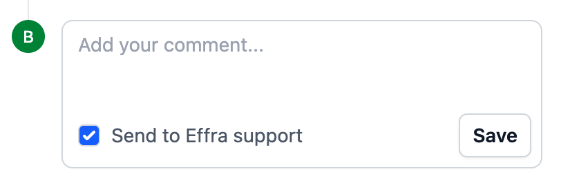

<iframe
  src="https://drive.google.com/file/d/1rO0bWQ_gAAGA9o1B852l7YIJIKadb7v6/preview"
></iframe>

The steps below outline how to get going and get your invoices paid more quickly and easily using Effra.

1. Raise invoices within your practice management system (PMS) as normal. Effra will import and process these within 15 minutes.
2. Invoices will move into the “action required” state if they need your input and they have a note letting you know what’s needed. You can use the filter at the top of the invoices page to see a [list of any invoices in “action required”](https://app.effra.io/invoices?query%5Bstatus%5D=&query%5Bstatus%5D=Action+Required&query%5Bdate_field%5D=Invoice+Date&query%5Bdate_from%5D=&query%5Bdate_to%5D=&query%5Bprovider_id%5D=&query%5Binsurer%5D=&query%5Binvoice_number%5D=).
3. Once Effra has everything needed to submit the invoices, they move into the “submitted” state while they’re waiting for the insurer to adjudicate them.
4. Effra will then automatically process your remittance statements but you just need to make sure we’re getting them:
   1. Bupa Providers Online - we would have set this up during your onboarding and we’ll pull remittances automatically.
   2. Remittance statements by email - forward these to the unique email address you were given during onboarding. We advise setting up a rule to forward them automatically. (Instructions for [Gmail](https://support.google.com/mail/answer/10957?hl=en-GB) and [Outlook](https://support.microsoft.com/en-gb/office/use-rules-to-automatically-forward-messages-45aa9664-4911-4f96-9663-ece42816d746)).
   3. Remittance statements by post - take a high quality photo or scan and email these to the unique email address you were given during onboarding.
   4. Healthcode - we can set up access to be able to get these automatically. If we haven’t already set this up, contact [onboarding](mailto:onboarding@effra.io).
1. If any invoices are shortfalled and aren’t the patient’s responsibility (for example the insurer thinks you’ve charged too much) they will move into the “insurer shortfall” status. You should review these and decide what action to take. If you want to resubmit them, just let us know in the comments for that invoice.
2. For shortfalls that patients need to pay, Effra sends them an invoice due in 5 days. These use your branding and if the patient replies to ask a question it will go to you, so that you remain in control of the patient experience.
   1. If you’re using card on file Effra will collect the payment automatically after 5 days.
   2. If any patients fail to pay their invoice after 28 days, we’ll email you to let you know so you can escalate.

If you need help with any invoice you can simply leave a comment on it and tick the “Send to Effra support” box then our team will get back to you.

